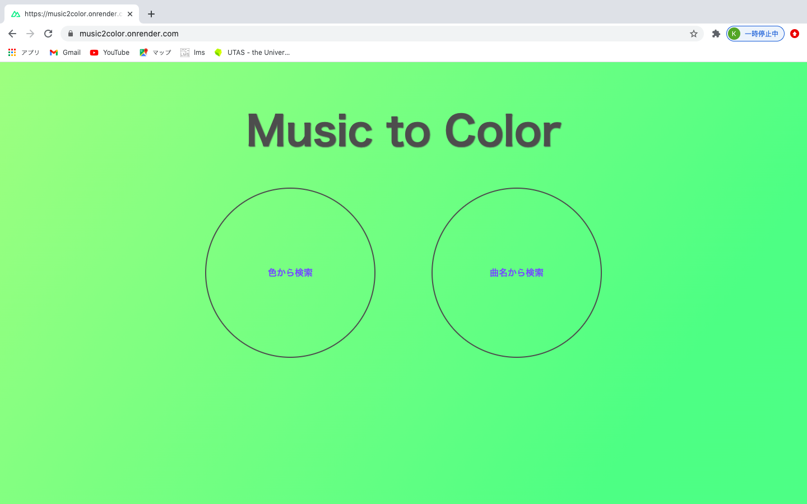
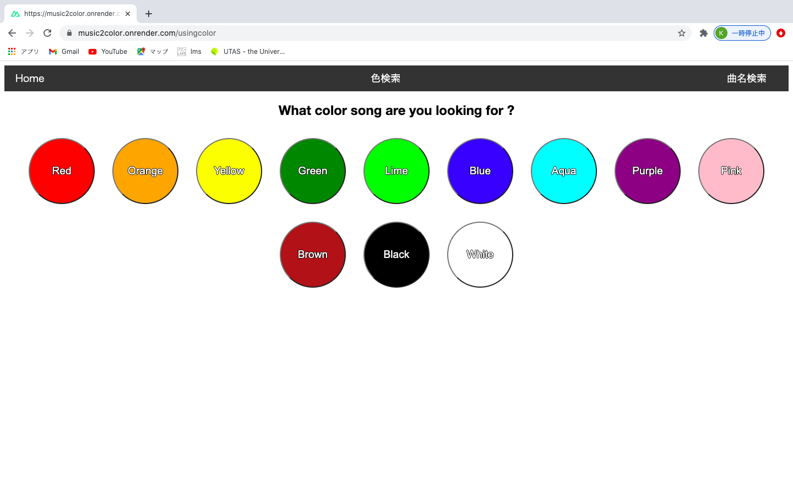
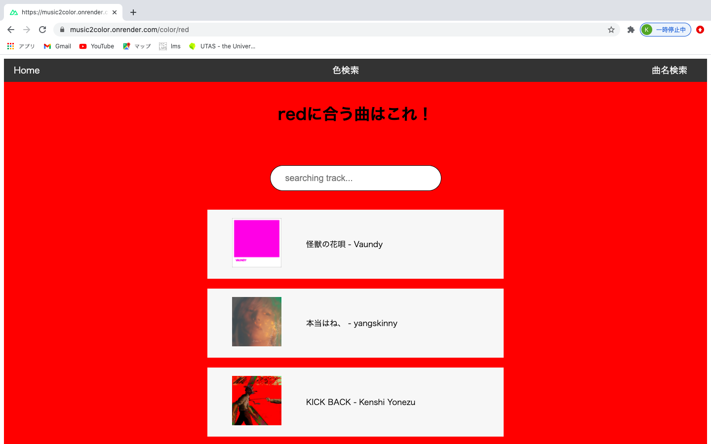
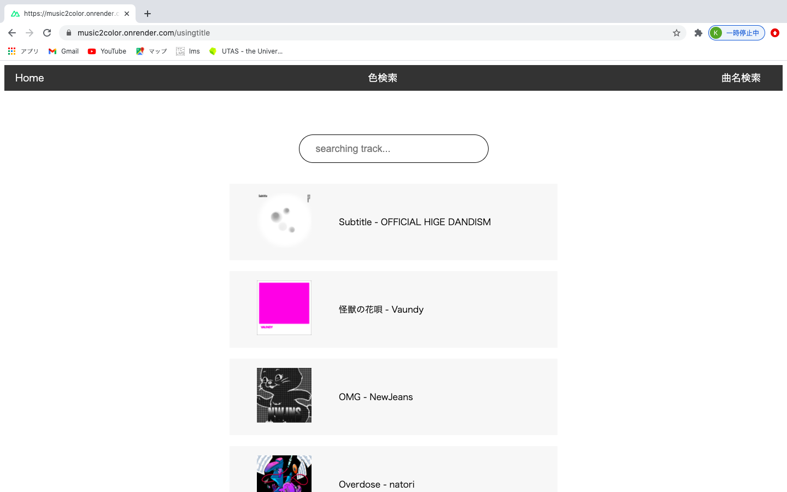
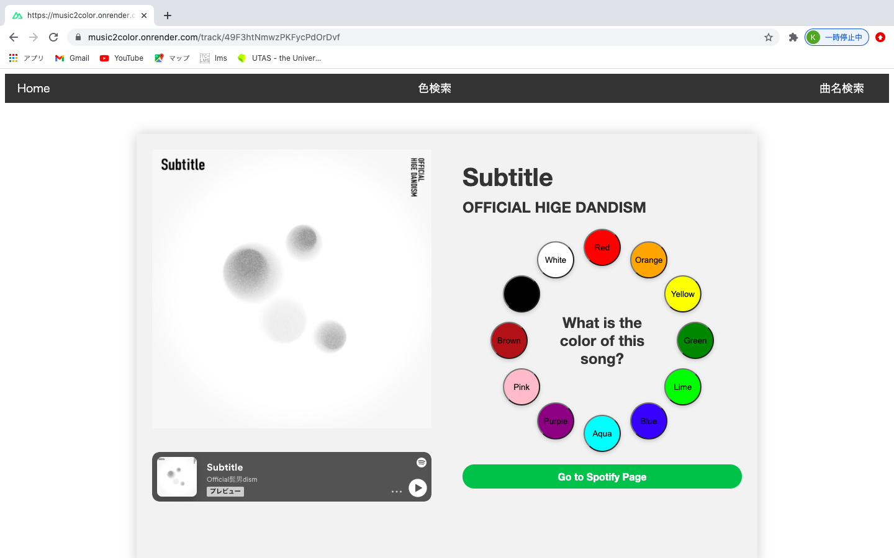

# music2color

nuxt3 を使って開発。render でデプロイしました。
music2color.onrender.com/

## 楽曲と色の対応を考える web アプリ

- 検索
  [トップページ](https://music2color.onrender.com/)からは、[色から検索](https://music2color.onrender.com/usingcolor)と、[曲名から検索](https://music2color.onrender.com/usingtitle)を選択して、2 種類の方法で曲を検索できます。

  - 色から検索
    
    
    ユーザの投票結果を学習した AI(決定木の分類モデル)が曲の色を決定し、各色に対応づけられた曲を一覧で見ることができます。
  - 曲名から検索
    
    登録されている全曲を一覧で見ることができます。曲名やアーティスト名で検索できます。

- 投票
  
  それぞれのページから遷移できる曲のページで、その曲が喚起する色のイメージを投票できます。投票するたびに ai が再学習して色の分類が変わります。例えば、[これ](https://music2color.onrender.com/track/49F3htNmwzPKFycPdOrDvf)は Offical 髭男 dism のページです。曲を再生したり、その曲の spotify のページに飛んだりすることもできます。
- AI

  spotifyAPI から取得できるパラメータを特徴量として分類モデルを作成しています。主なパラメータには tempo,key,danceability,loudness などがあります。説明可能性を重視するため、決定木の分類モデルを使っています。
